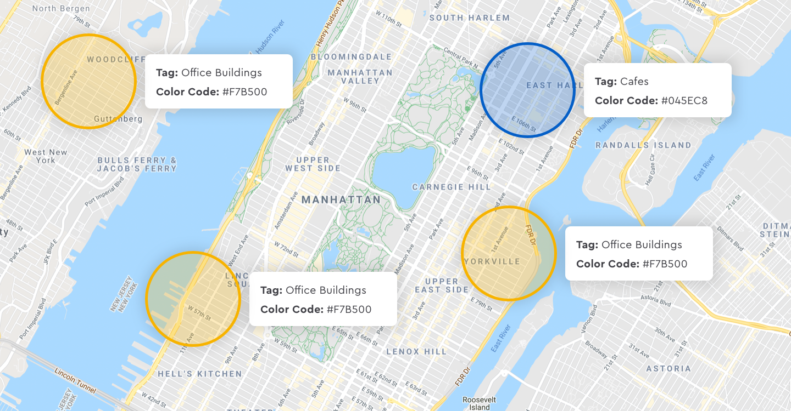

# Geofencing

Geofence is a virtual perimeter for a real-world geographical area. A geofence can be dynamically generated for two types - a radius around a location point \(circle geofence\) or a pre-defined set of boundaries \(polygon geofence\), such as stores, neighborhoods, or even cities. 

The use of geofence is called geofencing. A location-aware device \(iOS & Android devices\) user entering or exiting a geofence. The activity will trigger entry and exit events which can be used to sent alerts to the user's mobile device or be used the event to perform actions and tasks in the backend.

## Base URL

The Roam API is organized around [REST](http://en.wikipedia.org/wiki/Representational_State_Transfer). Our API has predictable resource-oriented URLs, accepts [JSON-encoded](https://www.json.org) request bodies, returns [JSON-encoded](http://www.json.org/) responses, and uses standard HTTP response codes, authentication, and verbs.

```scheme
https://api.roam.ai/v1/api/geofence
```

### Authentication

The Roam API uses API keys to authenticate requests. You can view and manage your API keys in the Roam Dashboard.

Your API keys carry many privileges, so be sure to keep them secure! Do not share your secret API keys in publicly accessible areas such as GitHub, client-side code, and so forth. Authentication to the API is performed via a custom header `Api-Key`. Provide your API key as the value for the header `Api-Key`

All API requests must be made over [HTTPS](http://en.wikipedia.org/wiki/HTTP_Secure). Calls made over plain HTTP will fail. API requests without authentication will also fail.

## Create Geofence

Geofence can be created using Roam API. Geofence can be created over circle or polygon geometry. Geofence by default is applicable to all users of a project but can be restricted to a set of users or users belonging to a user group. Geofence can also be configured to be enabled for a specified time interval. 



## Geofence Types:

Roam supports geofences of 2 different geometry type:

1. Circle
2. Polygon

### Circle Geofence

A circle geofence is a radius around a location point. To create a circle geofence the **required body parameters** are **** `coordinates`, and `geometry_radius` .


#### Sample Request // Circle Geofence



```scheme
curl --location --request POST 'https://api.roam.ai/v1/api/geofence/' \
--header 'Api-Key: e566c098cc6b441a9c3453b6fcf76e88' \
--header 'Content-Type: application/json' \
--data-raw '{
	"coordinates": [ -72.28122, 42.926042 ] ,
	"geometry_radius": 177,
	"is_enabled": [true, "2021-06-10T18:45:00", "2021-06-10T19:29:00"]
}'
```



#### Sample Response // Circle Geofence


```scheme
{
    "status": true,
    "msg": "Geofence Added successfully.",
    "code": 201,
    "data": {
        "geofence_id": "60e59c73ffb3fb58a9c6eb64",
        "geometry_type": "circle",
        "geometry_radius": 177,
        "geometry_center": {
            "type": "Point",
            "coordinates": [
                -72.28122,
                42.926042
            ]
        },
        "is_enabled": [
            true,
            "2021-06-10T18:45:00.000",
            "2021-06-10T19:29:00.000"
        ],
        "is_deleted": false,
        "created_at": "2021-07-07T12:22:11.105",
        "updated_at": "2021-07-07T12:22:11.105"
    }
}
```


### Polygon Geofence

A polygon geofence is a set of pre-defined boundaries of any shape around a location area. To create a circle geofence the **required body parameters** are ****`geometry_type`  and`coordinates`.


#### Same Request to create a Polygon geofence



```scheme
curl --location --request POST 'https://api.roam.ai/v1/api/geofence/' \
--header 'Api-Key: e566c098cc6b441a9c3453b6fcf76e88' \
--header 'Content-Type: application/json' \
--data-raw '
{
   "coordinates":[
      [
         -0.08789347686767579,
         51.50619618452938
      ],
      [
         -0.0905934768676758,
         51.50619618452938
      ],
      [
         -0.0905934768676758,
         51.503796184529385
      ],
      [
         -0.08789347686767579,
         51.50619618452938
      ]
   ],
   "is_enabled": [
      true,
      "2021-06-10T18:45:00",
      "2021-06-10T19:29:00"
    ]
}'
```



#### Sample Response

```scheme
{
    "status": true,
    "msg": "Geofence Added successfully.",
    "code": 201,
    "data": {
        "geofence_id": "60e59cfaffb3fb58a8c6eb66",
        "geometry": {
            "type": "Polygon",
            "coordinates": [
                [
                    [
                        -0.08789347686767579,
                        51.50619618452938
                    ],
                    [
                        -0.0905934768676758,
                        51.50619618452938
                    ],
                    [
                        -0.0905934768676758,
                        51.503796184529385
                    ],
                    [
                        -0.08789347686767579,
                        51.50619618452938
                    ]
                ]
            ]
        },
        "geometry_type": "polygon",
        "geometry_center": {
            "type": "Point",
            "coordinates": [
                -0.08969347686882724,
                51.505396185373506
            ]
        },
        "is_enabled": [
            true,
            "2021-06-10T18:45:00.000",
            "2021-06-10T19:29:00.000"
        ],
        "is_deleted": false,
        "created_at": "2021-07-07T12:24:26.197",
        "updated_at": "2021-07-07T12:24:26.197"
    }
}
```

## User Specific Geofence

Let's you monitor geofence events for a specific user or a list of users, by passing `user_ids` that were generated at the time of creating a user. Or you group users using the Groups ID which will give you a `group_id`. By default if `user_ids` and `group_ids` are not specified then the geofence is activated for all users of the project. __

### Based on User ID

Pass a `user_id` under the `"user_ids"` body parameter. Pass an array of  `user_id` to create a geofence specific for multiple users.


#### Sample Request  for single User ID



```scheme
curl --location --request POST 'https://api.roam.ai/v1/api/geofence/' \
--header 'Api-Key: e566c098cc6b441a9c3453b6fcf76e88' \
--header 'Content-Type: application/json' \
--data-raw '{
	"geometry_type": "circle",
	"coordinates": [ -72.28122, 42.926042 ] ,
	"geometry_radius": 177,
	"is_enabled": [true, "2021-06-10T18:45:00", "2021-06-10T19:29:00"],
	"user_ids": ["6bda16edea01848b3b419163"]
}'
```



#### Sample Request  for multiple User IDs



```scheme
curl --location --request POST 'https://api.roam.ai/v1/api/geofence/' \
--header 'Api-Key: e566c098cc6b441a9c3453b6fcf76e88' \
--header 'Content-Type: application/json' \
--data-raw '{
	"geometry_type": "circle",
	"coordinates": [ -72.28122, 42.926042 ] ,
	"geometry_radius": 177,
	"is_enabled": [true, "2021-06-10T18:45:00", "2021-06-10T19:29:00"],
	"user_ids": ["6bda16edea01848b3b419163", "6bda16edea01848b3b419163"]
}'
```



### Based on Group ID

Pass a `group_id` under the `"group_ids"` body parameter. Pass multiple and array of `group_id`  to create a geofence specific for multiple groups.


#### Sample Request  for single Group ID



```scheme
curl --location --request POST 'https://api.roam.ai/v1/api/geofence/' \
--header 'Api-Key: e566c098cc6b441a9c3453b6fcf76e88' \
--header 'Content-Type: application/json' \
--data-raw '{
	"geometry_type": "circle",
	"coordinates": [ -72.28122, 42.926042 ] ,
	"geometry_radius": 177,
	"is_enabled": [true, "2021-06-10T18:45:00", "2021-06-10T19:29:00"],
	"group_ids": ["6bda16edea01848b3b419163"]
}'
```



#### Sample Request  for multiple Group ID



```scheme
curl --location --request POST 'https://api.roam.ai/v1/api/geofence/' \
--header 'Api-Key: e566c098cc6b441a9c3453b6fcf76e88' \
--header 'Content-Type: application/json' \
--data-raw '{
	"geometry_type": "circle",
	"coordinates": [ -72.28122, 42.926042 ] ,
	"geometry_radius": 177,
	"is_enabled": [true, "2021-06-10T18:45:00", "2021-06-10T19:29:00"],
	"group_ids": ["6bda16edea01848b3b419163", "6bda16edea01848b3b419163"]
}'
```



## Time-Aware Geofence


Create time aware geofences to trigger events between a specific time range by passing date and time in an array as 2nd and 3rd element to `is_enabled`field of the body parameters.

During the specified time the entry and exit events will be triggered and outside the time you need to ensure `"is_enabled"` as `"false"` 



```scheme
curl --location --request POST 'https://api.roam.ai/v1/api/geofence/' \
--header 'Api-Key: e566c098cc6b441a9c3453b6fcf76e88' \
--header 'Content-Type: application/json' \
--data-raw '{
	"geometry_type": "circle",
	"coordinates": [ -72.28122, 42.926042 ] ,
	"geometry_radius": 177,
	"is_enabled": [true, "2021-06-10T18:45:00", "2021-06-10T19:29:00"]
}'
```



#### Sample Response

```scheme
{
    "status": true,
    "msg": "Geofence Added successfully.",
    "code": 201,
    "data": {
        "geofence_id": "60e59e9effb3fb58a3c6eb69",
        "geometry_type": "circle",
        "geometry_radius": 177,
        "geometry_center": {
            "type": "Point",
            "coordinates": [
                -72.28122,
                42.926042
            ]
        },
        "is_enabled": [
            true,
            "2021-06-10T18:45:00.000",
            "2021-06-10T19:29:00.000"
        ],
        "is_deleted": false,
        "created_at": "2021-07-07T12:31:26.437",
        "updated_at": "2021-07-07T12:31:26.437"
    }
}
```

## Personalize Geofence

### Description and Metadata

Adding a `description` and `metadata` can help identify and personalize the geofences while displaying them on a map.  You can add this information while creating a geofence or updating a geofence. 


#### Sample Request



```scheme
curl --location --request POST 'https://api.roam.ai/v1/api/geofence/' \
--header 'Api-Key: e566c098cc6b441a9c3453b6fcf76e88' \
--header 'Content-Type: application/json' \
--data-raw '{
	"geometry_type": "circle",
	"coordinates": [ -72.28122, 42.926042 ] ,
	"geometry_radius": 177,
	"description": "Google New York City",
  "metadata": {
  							"object_id": "10000234243241234",
  							"google_user_id": "000034"
  },
	"is_enabled": [true, "2021-06-10T18:45:00", "2021-06-10T19:29:00"]
}'
```



#### Sample Response

```scheme
{
  "status": true,
  "msg": "Geofence Added successfully.",
  "code": 201,
  "data": {
    "geofence_id": "60ee5decffb3fb728a120cb4",
    "geometry_type": "circle",
    "geometry_radius": 177,
    "geometry_center": {
      "type": "Point",
      "coordinates": [
        -72.28122,
        42.926042
      ]
    },
    "is_enabled": [
      true,
      "2021-06-10T18:45:00.000",
      "2021-06-10T19:29:00.000"
    ],
    "description": "Google New York City",
    "metadata": {
      "object_id": "10000234243241234",
      "google_user_id": "000034"
    },
    "is_deleted": false,
    "created_at": "2021-07-14T03:45:48.842",
    "updated_at": "2021-07-14T03:45:48.842"
  }
}
```

### Tags and Color Codes

Adding `tag` can help filter geofences easily by the tag. This field is optional. When a geofence event is generated `tag` is also sent along with the event.

`color_code` defines the color of Geofence and how it is displayed on the dashboard. Hex Code for CSS colors should be passed in this field without `#`. 



#### Sample Request



```scheme
curl --location --request POST 'https://api.roam.ai/v1/api/geofence/' \
--header 'Api-Key: e566c098cc6b441a9c3453b6fcf76e88' \
--header 'Content-Type: application/json' \
--data-raw '{
	"coordinates": [ -72.28122, 42.926042 ] ,
	"geometry_radius": 177,
	"description": "Google New York City",
	"metadata": {
        "object_id": "10000234243241234",
        "google_user_id": "000034"
        },
  "tag": "home",
  "color_code": "ffffff",
	"is_enabled": [true, "2021-06-10T18:45:00", "2021-06-10T19:29:00"]
}'
```



#### Sample Response

```scheme
{
  "status": true,
  "msg": "Geofence Added successfully.",
  "code": 201,
  "data": {
    "geofence_id": "60ee5e1effb3fb728c120d88",
    "geometry_type": "circle",
    "geometry_radius": 177,
    "geometry_center": {
      "type": "Point",
      "coordinates": [
        -72.28122,
        42.926042
      ]
    },
    "is_enabled": [
      true,
      "2021-06-10T18:45:00.000",
      "2021-06-10T19:29:00.000"
    ],
    "description": "Google New York City",
    "color_code": "ffffff",
    "tag": "home",
    "metadata": {
      "object_id": "10000234243241234",
      "google_user_id": "000034"
    },
    "is_deleted": false,
    "created_at": "2021-07-14T03:46:38.674",
    "updated_at": "2021-07-14T03:46:38.674"
  }
}
```

## Update Geofence

Geofence can be updated using Roam API by `PUT` request using the geofence endpoint. 



## Get Geofence

This API gives you the filtered list of geofences. You can filter by `geofence_id`, `created_at` date using `start_date` and `end_date` fields, `user_id` and `group_id`



#### Sample Request

### Using start\_date and end\_date

```javascript
curl --location --request GET 'https://api.roam.ai/v1/api/geofence/?start_date=2020-09-28&end_date=2020-09-29' \
--header 'Api-Key: e566c098cc6b441a9c3453b6fcf76e88'
```

### Using geofence\_id

```javascript
curl --location --request GET 'https://api.roam.ai/v1/api/geofence/?geofence_id=5f73326ce5fc231ba4b253eb' \
--header 'Api-Key: e566c098cc6b441a9c3453b6fcf76e88'
```

### Using user\_id

```javascript
curl --location --request GET 'https://api.roam.ai/v1/api/geofence/?user_id=6073325bcf3e4eba5a1123a' \
--header 'Api-Key: e566c098cc6b441a9c3453b6fcf76e88'
```

### Using group\_id

```javascript
curl --location --request GET 'https://api.roam.ai/v1/api/geofence/?group_id=6073325bc3fe343ab6c1324b' \
--header 'Api-Key: e566c098cc6b441a9c3453b6fcf76e88'
```

## Geofence Events

Roam's geofence feature has 2 possible events that can be triggered based on user behaviors

1. Geofence Entry Event - triggered when a user enters the defined geofence area
2. Geofence Exit Event - triggered when a user exits from the defined geofence area

**Sample Events:**

**Geofence Entry Event:**

```javascript
{
    "events": [
        {
            "user_id": "60e5646151efb06fe4c65b0d",
            "location_id": "60e566a4fa8a780000ed3194",
            "geofence_id": "60e566a28ce7db5726c1c1cd",
            "recorded_at": "2021-07-07T08:32:36.243Z",
            "event_source": "geospark:geofence",
            "event_version": "1.0",
            "event_type": "geospark:geofence:entry",
            "location": {
                "type": "Point",
                "coordinates": [
                    77.5573154,
                    9.4551286
                ]
            },
            "speed": 0,
            "course": 316.1922912597656,
            "altitude": 78.46394327410016,
            "activity": "M",
            "vertical_accuracy": null,
            "horizontal_accuracy": 10.565999984741211
        }
    ]
}
```

**Geofence Exit Event:**

```javascript
{
    "events": [
        {
            "user_id": "60e5646151efb06fe4c65b0d",
            "location_id": "60e566a4fa8a780000ed3194",
            "geofence_id": "60e566a28ce7db5726c1c1cd",
            "recorded_at": "2021-07-07T08:32:36.243Z",
            "event_source": "geospark:geofence",
            "event_version": "1.0",
            "event_type": "geospark:geofence:exit",
            "location": {
                "type": "Point",
                "coordinates": [
                    77.5573154,
                    9.4551286
                ]
            },
            "speed": 0,
            "course": 316.1922912597656,
            "altitude": 78.46394327410016,
            "activity": "M",
            "vertical_accuracy": 5,
            "horizontal_accuracy": 10.565999984741211
        }
    ]
}
```

### Enable Events

To process geofences for a user,  `geofence_events` flag must be set to true for the user. This can be done from sdk using `Roam.toggleEvents` method or by updating user using API. If `geofence_events` flag is false for a user then geofence events are not processed for the location updates on the user. The user should also have `publishandsave` enabled in sdk.

### Events via Webhook

Roam supports posting of events to webhook in realtime. To enable posting events via webhook first the webhook url needs to be configured in the project using the dashboard \(Project Settings -&gt; integration\) and should be enabled.


### Events via API

Geofence events can be retrieved using Roam API. The Get Events API lets you fetch the entry or exit events of the users from your event enabled geofences. The API also lets you filter by user or geofence, location, and more.



## Delete Geofence

Delete any existing geofences from your projects by using the `geofence_id`




