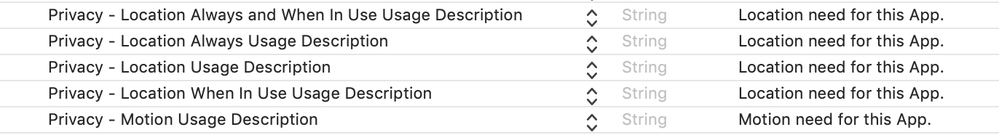

# Quickstart

GeoSpark provides an iOS SDK that enables App developers to track location, geofence and trips.

## Step 1: Install SDK

Install using Cocoapods, open `podfile` add SDK to file.

```groovy
pod 'GeoSpark'
```

Once you have updated your Podfile run `pod install` in your terminal.

Import GeoSpark into your `AppDelegate` file.



```swift
import GeoSpark
```



```objectivec
#import <GeoSpark/GeoSpark.h>
```



## **Step 2: Configure project**

To configure the location services, add following entries to the `Info.plist` file.



Then, in your project settings, go to `Capabilities > Background Modes` and turn on background fetch, location updates ,remote-notifications.


## **Step 3: Initialize SDK**

Initialize the SDK in your `AppDelegate` class before calling any other GeoSpark methods under this `application:didFinishLaunchingWithOptions:`



```swift
func application(_ application: UIApplication, didFinishLaunchingWithOptions launchOptions: [UIApplication.LaunchOptionsKey: Any]?) -> Bool {
    GeoSpark.intialize("PUBLISHABLEKEY")
        return true
  }
```



```objectivec
- (BOOL)application:(UIApplication *)application didFinishLaunchingWithOptions:(NSDictionary *)launchOptions {
    [GeoSpark intialize:@"PUBLISHABLEKEY"];
    return YES;
}
```



## **Step 4: Create User**

The SDK needs an User ID object to identify the device. Before creating user you should have device token as you cannot create user without device token.



```swift
  GeoSpark.createUser("User Description",{ (user) in
      // user.userId
    },onFailure: { (error) in
      // error.errorCode
      // error.errorMessage
  })
```



```objectivec
  [GeoSpark createUser:@"User Description" :^(GeoSparkUser * user) {
      // user.userId
    } onFailure:^(GeoSparkError * error) {
      // error.errorCode
      // error.errorMessage
  }];
```



## **Step 5: Start Location Tracking**

To start tracking the location



```swift
// To enable motion and location, call requestMotion and requestLocation methods.
if GeoSpark.isMotionEnabled() == false {
    GeoSpark.requestMotion()
 }else if GeoSpark.isLocationEnabled() == false{
    GeoSpark.requestLocation()
  }else {
    GeoSpark.startTracking()
 }
```



```objectivec
if ([GeoSpark isMotionEnabled] == false) {
    [GeoSpark requestMotion];
 }else if ([GeoSpark isLocationEnabled] == false){
    [GeoSpark requestLocation];
 }else {
    [GeoSpark startTracking];
 }
```



