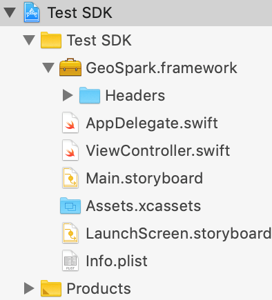

# Troubleshooting

## Requirements

* iOS Version 10.0 and above

## **Install SDK Manual**

[Download](https://s3.amazonaws.com/geospark-frameworks/iOS/GeoSpark.zip) and unzip the GeoSpark SDK.

Add the GeoSpark SDK to your Xcode Project by dragging the file into your Project Navigator.

You can do this by selecting the project file in the navigator on the left side of the Xcode window, and then navigating to the Linked Frameworks and Libraries section. From there, click the + button to add the GeoSpark frameworks.

