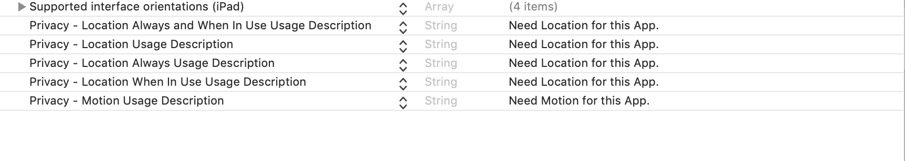
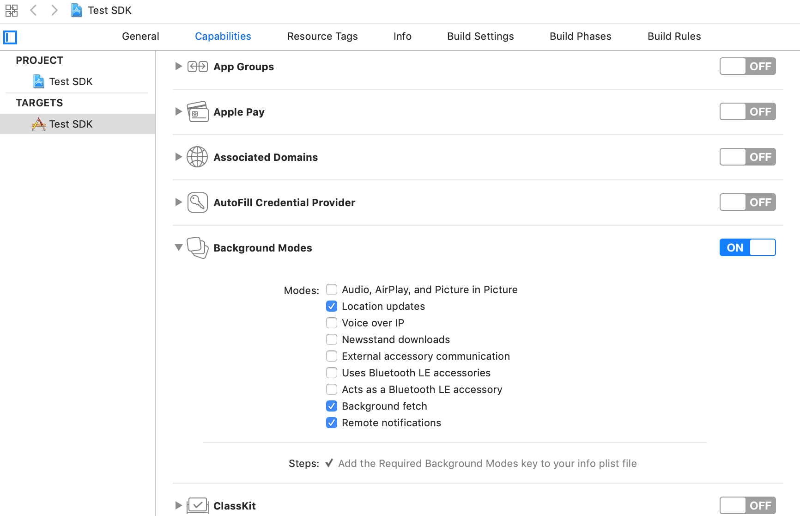

# Quickstart

## Step 1: Install the module

In your project directory, install from npm, and then link it.

```typescript
$ npm install react-native-geospark --save
$ react-native link react-native-geospark
```

## Step 2. Install SDK

### **iOS**

Install using Cocoapods, open `podfile` and add SDK to file.

```groovy
pod 'GeoSpark'
```

Once you have updated your `podfile`, ****run `pod install` in your terminal.

#### **Configure project**

To configure the location services, add following entries to the **Info.plist** file.



Then, in your project settings, go to `Capabilities > Background Modes` and turn on background fetch, location updates, remote-notifications.



Then, go to Build Settings in the project targets and change 'Always Embed Swift Standard Libraries' to 'Yes'.

####  **Manual Linking**

1. Open the iOS module files, located inside `node_modules/react-native-geospark/ios/`.
2. Open the app workspace file `(AppName.xcworkspace)` in Xcode.
3. Move the `RNGeoSpark.h` and `RNGeoSpark.m` files to your project. When shown a popup window, select Create groups.

### **Android**

Install the SDK to your project via `Gradle` in Android Studio, add the dependencies below in your `app build.gradle` file.

```groovy
dependencies {
        implementation'com.geospark.android:geospark:2.2.5' 
}
```

## Step 3. Initialize SDK

Import the module in `App.js` file

```jsx
import GeoSpark from 'react-native-geospark'; 
```

### **Android**

Initialize the SDK with your `publishable key`.

```java
//In onCreate method of your Application class include the code below.
public class MainApplication extends Application implements ReactApplication {
   @Override
   public void onCreate() {
        super.onCreate();
        SoLoader.init(this, / native exopackage / false);
        GeoSpark.initialize(this, "PUBLISH_KEY");
   }
}    
```

### **iOS**

Import GeoSpark into your `AppDelegate` file.



```swift
import GeoSpark
```



```objectivec
#import <GeoSpark/GeoSpark.h>
```



Initialize the SDK in your `AppDelegate` class before calling any other GeoSpark methods under this `application:didFinishLaunchingWithOptions:`



```swift
func application(_ application: UIApplication, didFinishLaunchingWithOptions launchOptions: 
[UIApplication.LaunchOptionsKey: Any]?) -> Bool {
    GeoSpark.intialize("PUBLISHABLEKEY")
        return true
}
```



```objectivec
- (BOOL)application:(UIApplication *)application didFinishLaunchingWithOptions:(NSDictionary *)launchOptions 
{
    [GeoSpark intialize:@"PUBLISHABLEKEY"];
    return YES;
}
```



## Step 4. Create a user

GeoSpark SDK needs a User ID object to identify the device.

```jsx
GeoSpark.createUser("User Description", (success) => { 
  // do something on success    
}, (error) => {
 // do something on error
});
```

## Step 5. Get permissions

Get location permission from the App user on the device. Also check if the user has turned on location services for the device. In addition, get motion permission for iOS.

```jsx
// Call this method to check Location Permission for Android & iOS
GeoSpark.checkLocationPermission( (status) => {
    // do something with status
});
​
// Call this method to request Location Permission for Android & iOS
GeoSpark.requestLocationPermission();
```

```jsx
// Call this method to check Motion Permission for iOS and above Android10
GeoSpark.checkMotionPermission( (status) => {
    // do something with status
});
// Call this method to request Motion Permission for iOS and above Android10
GeoSpark.requestMotionPermission();
```

### **Android**

```jsx
// Call this method to check Location services for Android
GeoSpark.checkLocationServices( (status) => {
    // do something with status
}); 
​
// Call this method to request Location services for Android
GeoSpark.requestLocationServices();
```

To start tracking the location above Android 10

```jsx
// Call this method to check background location permission for Android
GeoSpark.checkBackgroundLocationPermission( (status) => {
        // do something with status
});
// Call this method to request background location Permission for Android
GeoSpark.requestBackgroundLocationPermission();
```

## Step 6. Start Location tracking

To start tracking the location.

```jsx
GeoSpark.startTracking();
```

